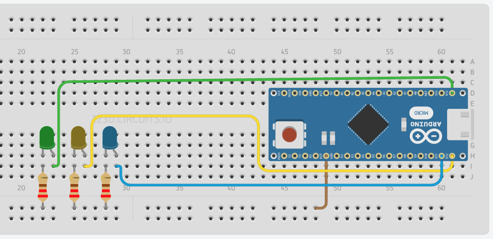

# Arduino Voice Controller

## Arduino Setup
1. Follow the instructions for your setup the firmware of your board at [johnny-five].
2. Connect the Arduino to the PC using a usb cable.

## Server Install

```
npm i
node index.js
```

Now you can open the page at http://localhost:3000/

## Rooms
* my room
* kitchen
* bathroom

## Actions
* turn on
* turn off

## Devices
* light

## Syntaxis
```
<action> <device> <room>
```

## Examples
* turn on the light of my room
* turn on light in my room
* turn off the light in the kitchen

## Arduino Example


## References
* [Web Specch Api]
* [Web Specch Api Examples]

## License
[MIT]

[Web Speech Api]: <https://github.com/mdn/web-speech-api/>
[johnny-five]: <http://johnny-five.io/>
[MIT]: License
[Web Specch Api Examples]: <https://github.com/mdn/web-speech-api/>
[Web Specch Api]: <https://developer.mozilla.org/en-US/docs/Web/API/Web_Speech_API>
